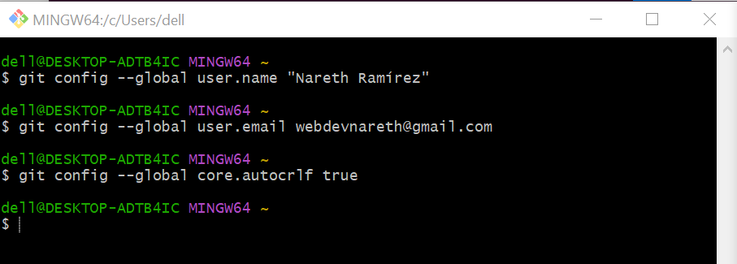
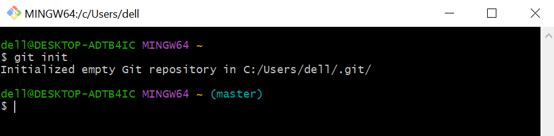
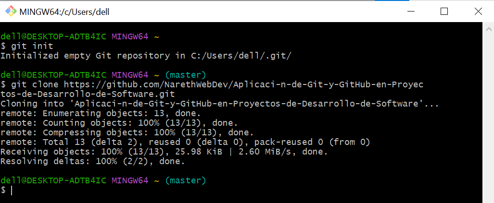
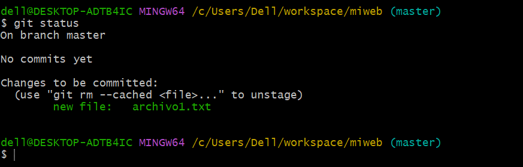
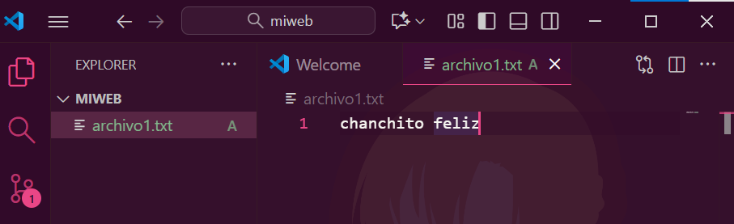
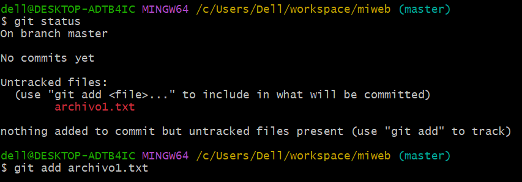
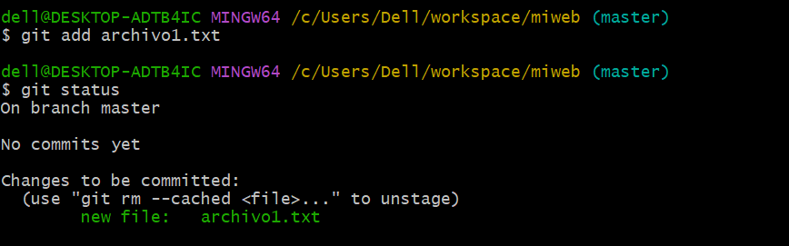
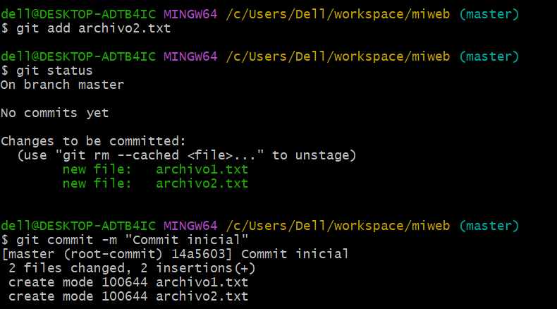

# Aplicación de Git y GitHub en Proyectos de Desarrollo de Software

##  ¿Qué es Git?

Git es un **sistema de control de versiones distribuido**, es deci un software que permite:

- Registrar todo el historial de cambios de un proyecto.
- Trabajar en diferentes versiones de un proyecto simultáneamente.
- Colaborar con otros desarrolladores sin conflictos.
- Recuperar versiones anteriores del código.
- Mantener un historial completo de modificaciones.

*Ventajas principales de su uso:*
- Es gratuito y de código abierto.
- Funciona sin conexión a internet.
- Es bastante rápido y eficiente.
- Utilizado por millones de desarrolladores en todo el mundo.

## ¿Qué es GitHub?
GitHub es una plataforma basada en la nube donde cada desarrollador puede almacenar, compartir y trabajar junto con otros usuarios para escribir código. Almacenar el código en un *"repositorio"* en GitHub nos permite:

- Presentar o compartir el trabajo realizado.
- Dejar que otros usuarios revisen el código y realicen sugerencias para mejorarlo.
- Mantener un seguimiento detallado del progreso.
- Herramientas de colaboración (pull requests, issues).
- Tener un hosting gratuito para proyectos públicos y privados.

# Principales Comandos de Git
## 1. Configuración Inicial

_Establece la identidad para todos los commits que uno vaya a realizar y se configura el salto de línea dependiendo del Sistema Operativo en que se encuentre, en este caso es Windows por lo que tiene que tener su valor tru y los caracteres cr (para subir código) y lf (si se quiere descargar código del repositorio). Es importante usar el mismo email que tiene en GitHub_

## 2. `git init`

_Inicializa un nuevo repositorio Git en el directorio actual. Crea una carpeta oculta `.git` que contiene toda la información del control de versiones._
**Cuándo usarlo:** Al comenzar un nuevo proyecto desde cero.

## 3. `git clone`

_Descarga una copia completa de un repositorio remoto a tu máquina local, incluyendo todo el historial de cambios._

**Cuándo usarlo:** Para trabajar en un proyecto existente.

## 4. `git status`

_Muestra el estado actual del repositorio:_
_- Archivos modificados_
_- Archivos nuevos sin seguimiento_
_- Archivos preparados para commit_
_- Rama actual en la que te encuentras_

**Cuándo usarlo:** Constantemente, para verificar el estado de tus cambios.

## 5. `git add`
(Creamos un archivo llamado "Archivo1.txt")

---
Si no se agrega el archivo creado a la terminal no lo ejecutará

---
(Agrega el archivo1.txt al terminal para ser enviado al "staging area")

_Prepara los archivos para el próximo commit, moviéndolos al "staging area" (área de preparación)._
---
## 6. `git commit`

_Guarda los cambios preparados en el historial del repositorio con un mensaje descriptivo._

**Buenas prácticas para mensajes:**
_- Usar verbos en imperativo: "Agrega", "Corrige", "Actualiza"._
_- Ser específico y conciso._
_- Explicar el QUÉ y el POR QUÉ, no el CÓMO._
